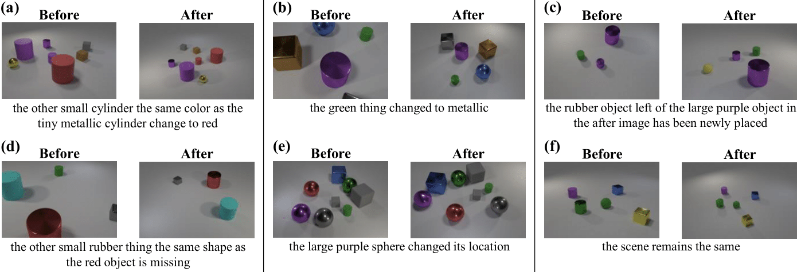

# CLEVR-DC

CLEVR-DC dataset used for paper:

**Viewpoint-Agnostic Change Captioning with Cycle Consistency** <br />
Hoeseong Kim, Jongseok Kim, Hyungseok Lee, Hyunsung Park, Gunhee Kim <br />
To appear at [ICCV 2021](http://iccv2021.thecvf.com/)

## Reference

If you find this repository useful, please cite the following paper:
```bibtex
@inproceedings{kim2021viewpoint,
  title={Viewpoint-Agnostic Change Captioning with Cycle Consistency},
  author={Kim, Hoeseong and Kim, Jongseok and Lee, Hyungseok and Park, Hyunsung
          and Kim, Gunhee}
  booktitle={ICCV},
  year={2021}
}
```

## Introduction

CLEVR-DC is a CLEVR dataset for change captioning under drastic viewpoint
changes. In contrast to other datasets with relatively small camera jitters, we
reposition the camera to a random location in the after image. For the after
scene, we perform one of the following:
- Change the color of one of the objects
- Change the texture (material) of one of the objects
- Add a random object
- Remove a random object
- Move a random object
- Do nothing (distractor)

We generate 8,000 images for each action. The split we used is included in
`split.json`.

## Examples

<div align="center">
  
</div>
